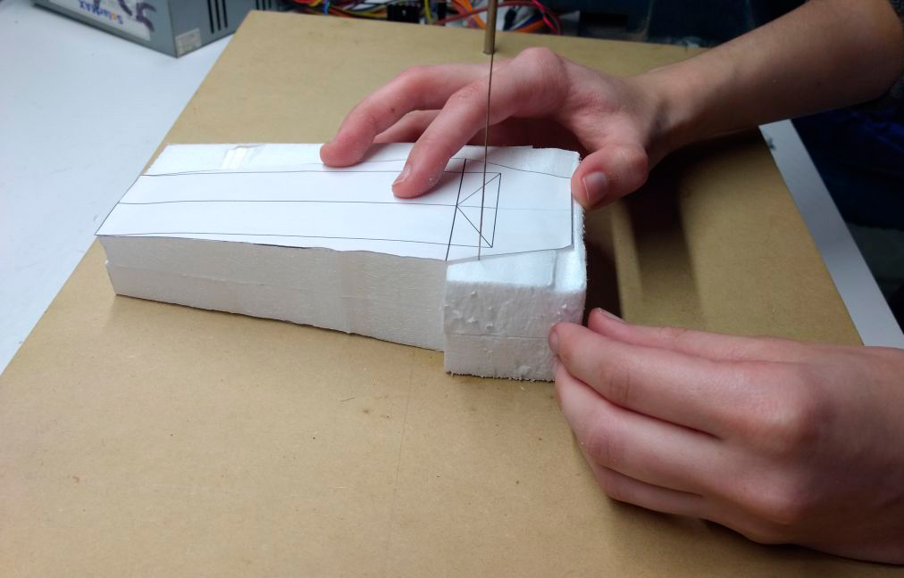
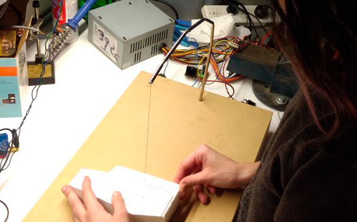
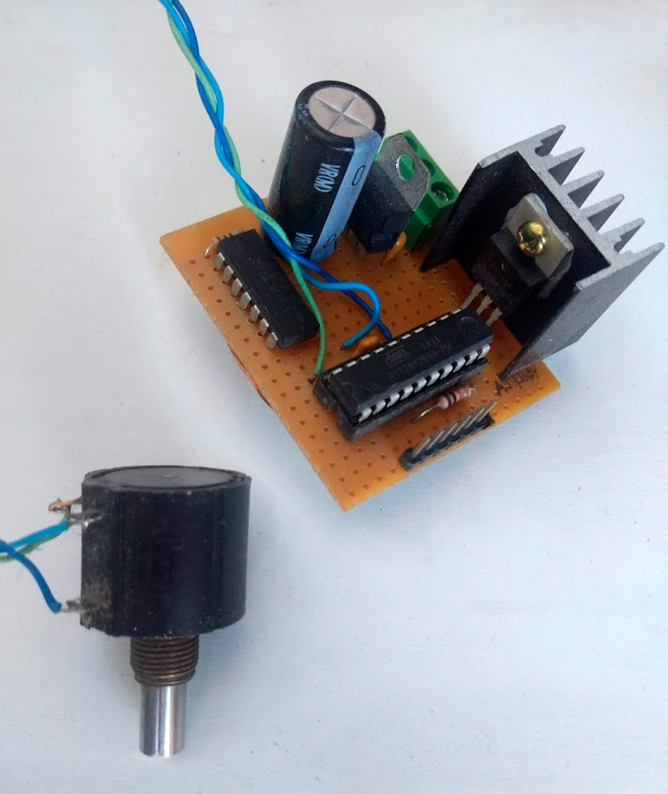

# Foam Cutter (2017)
Basic foam cutter using a nichrome wire. Uses a multiturn potentiometer to fine tune the power/temperature.

# Hardware
It's a 50x30 flat MDF board, with some rigid steel bar. On the edge, a 0.7mm? nichrome wire is clamped using a machine screw.
[It's based on this design, with some modifications](https://www.youtube.com/watch?v=3GWzHb4Hd8Y).

# Schematic
Not created yet, but it basically consists of 
- ATtiny261
- (half of) IR2110 as a MOSFET driver
- 7805 for 5V regulation
- IRFZ44 MOSFET

The 12V can come from a PC power supply, which can easily supply many amps of current.

# Firmware
Can be compiled using AVR-GCC. It basically reads the voltage out of the potentiometer and generates a PWM signal that is used to drive the MOSFET.
